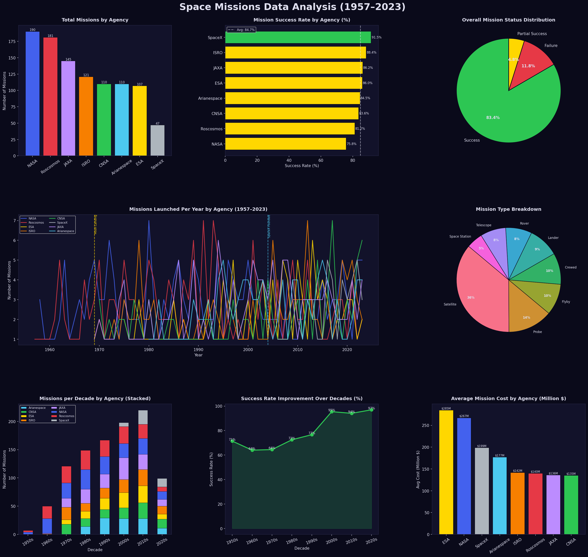

# 🚀 Space Missions Data Visualization (1957–2023)

### CodeAlpha Data Analytics Internship – Task 3

This project demonstrates the application of **Data Visualization, Exploratory Data Analysis, and Insight Generation** using Python. The analysis focuses on global space missions conducted between 1957 and 2023 to uncover trends in mission activity, success rates, mission types, and agency performance.


## 📌 Project Overview

The objective of this project is to analyze historical space mission data and transform it into meaningful visual insights through a comprehensive dashboard.

Using multiple visualizations, the project explores mission trends across major space agencies, evaluates mission success rates, examines mission costs, and highlights the evolution of space exploration over several decades.


## 🎯 Project Objectives

* Analyze space mission trends from 1957–2023.
* Compare mission activity among major space agencies.
* Evaluate mission success rates.
* Examine the distribution of mission types.
* Study mission cost patterns across agencies.
* Visualize improvements in mission success over time.
* Generate meaningful insights through visual storytelling.


## 📊 Dataset Information

The dataset contains information about space missions conducted by major global space agencies.

| Attribute  | Description                  |
| ---------- | ---------------------------- |
| Dataset    | Space Missions Dataset       |
| Type       | Simulated Analytical Dataset |
| Records    | 1,011 Missions               |
| Features   | 10 Columns                   |
| Year Range | 1957–2023                    |

### Features Used

| Feature       | Description                |
| ------------- | -------------------------- |
| agency        | Space agency name          |
| country       | Country or region          |
| year          | Mission launch year        |
| mission_type  | Type of mission            |
| status        | Mission outcome            |
| cost_million  | Mission cost (Million USD) |
| duration_days | Mission duration           |
| crew_size     | Number of crew members     |
| decade        | Mission decade             |
| is_success    | Success indicator          |


## 📈 Analysis Performed

The project includes:

* Mission Activity Analysis
* Success Rate Analysis
* Mission Status Distribution
* Agency Performance Comparison
* Mission Type Analysis
* Time-Series Trend Analysis
* Decade-Wise Mission Analysis
* Cost Analysis
* Data Visualization Dashboard


## 📊 Dashboard Visualizations

The generated dashboard (`space_missions_visualization.png`) includes:

| Visualization                         | Purpose                                             |
| ------------------------------------- | --------------------------------------------------- |
| Total Missions by Agency              | Compare mission activity across agencies            |
| Mission Success Rate by Agency        | Evaluate agency performance                         |
| Mission Status Distribution           | Analyze success, failure, and partial success rates |
| Missions Launched Per Year            | Observe mission trends over time                    |
| Mission Type Breakdown                | Study mission category distribution                 |
| Missions per Decade by Agency         | Compare historical agency activity                  |
| Success Rate Improvement Over Decades | Analyze technological progress                      |
| Average Mission Cost by Agency        | Compare mission expenditures                        |


## 🔑 Key Findings

### 🚀 Mission Activity

* NASA conducted the highest number of missions.
* Roscosmos closely followed NASA in overall mission count.
* SpaceX demonstrated rapid growth despite being a relatively new organization.

### ✅ Mission Success

* Overall mission success exceeded 80%.
* Success rates improved significantly in modern decades.
* SpaceX achieved one of the highest mission success rates.

### 📅 Historical Trends

* Mission activity increased steadily after the 1970s.
* Significant growth occurred during the 2000s and 2010s.
* Commercial space exploration accelerated mission launches.

### 🛰️ Mission Types

* Satellite missions represented the largest mission category.
* Probe and crewed missions accounted for a significant portion of space exploration activities.

### 💰 Cost Analysis

* NASA and ESA recorded the highest average mission costs.
* Agencies investing greater resources generally achieved higher mission reliability.

### 📈 Success Improvement

* Mission success rates improved dramatically over the decades.
* Technological advancements contributed significantly to increased mission reliability.


## 🛠 Technologies Used

* Python
* Pandas
* NumPy
* Matplotlib
* Seaborn


## ⚙️ Installation

### Install Required Libraries

```bash
pip install pandas numpy matplotlib seaborn
```


## ▶️ How to Run

Execute the script:

```bash
python space_missions_data_visualization.py
```

The script will automatically:

1. Generate the space missions dataset.
2. Perform exploratory analysis.
3. Create visualizations.
4. Generate the dashboard.
5. Save the dashboard as `space_missions_visualization.png`.
6. Display key findings in the console.


## 📁 Project Structure

```text
Space_Missions_Visualization/
│
├── space_missions_data_visualization.py
├── space_missions.csv
├── space_missions_visualization.png
└── README.md
```


### Space Missions Dashboard

<h2>🖼 Output</h2>

<p align="center">
  
</p>


## 🚀 Future Enhancements

* Use real-world space mission datasets from NASA and ESA.
* Develop interactive dashboards using Plotly or Streamlit.
* Incorporate predictive analytics for mission success forecasting.
* Perform country-wise space exploration analysis.
* Add machine learning models for mission outcome prediction.


## 👨‍💻 Author

**Sunil Pavan Raja**

Bachelor of Technology (Artificial Intelligence and Data Science)

Prathyusha Engineering College

GitHub: https://github.com/pavansunil75

E-mail id: pavansunil75@gmail.com


## 🙏 Acknowledgements

* CodeAlpha for providing the Data Analytics Internship opportunity.
* NASA, ESA, ISRO, SpaceX, and other space agencies for inspiring the analysis.
* The Data Science community for educational resources and visualization best practices.


## 📄 License

This project is intended for educational and internship purposes.

⭐ If you found this project useful, consider giving it a star.
